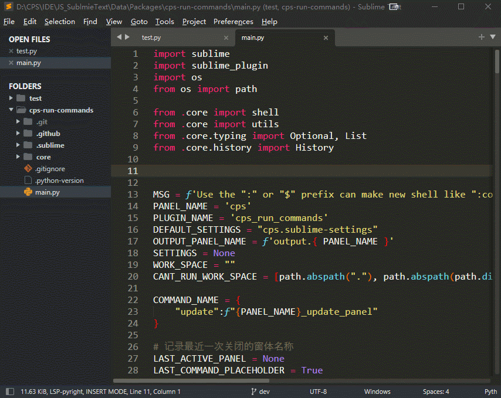

# 简介|Introductions

因为组内的项目都是我搭建的，特意写一个脚手架，可以快速生成一些项目结构，快速添加一些常用脚本到项目中。

<div>
    
    
    
</div>

[English](README.en.md) | 简体中文


# 使用|Usage

- **`Alt + f1` 调出命令输入框，直接执行`cmd`的命令**
```bash
# 调出输入框
alt + f1

# 支持单条命令
npm i

# 支持组合命令
git add . & git cz
mkdir projectName & cd projectName & npm init -y


# "$" 或者 ":" 前缀
# 在新的cmd窗口执行，且15秒后自动关闭
$npm init -y

# 在新的cmd窗口执行，按任意键才能关闭
:npm init -y
```



- **历史记录功能**
默认记录100条，最高500条


- **自定义配置**

```json
// Packages/User/cps.sublime-settings
{
  "name": "tett 插件",
  "author": "CPS",
  "mail": "373704015@qq.com",
  
  "cps_run_commands": {
    "default_workspace":".", // 默认的工作目录
    "history_count":100,     // 历史记录数量
  }
}

```


# 联系方式|Contact

- **373704015 (qq、wechat、email)**
